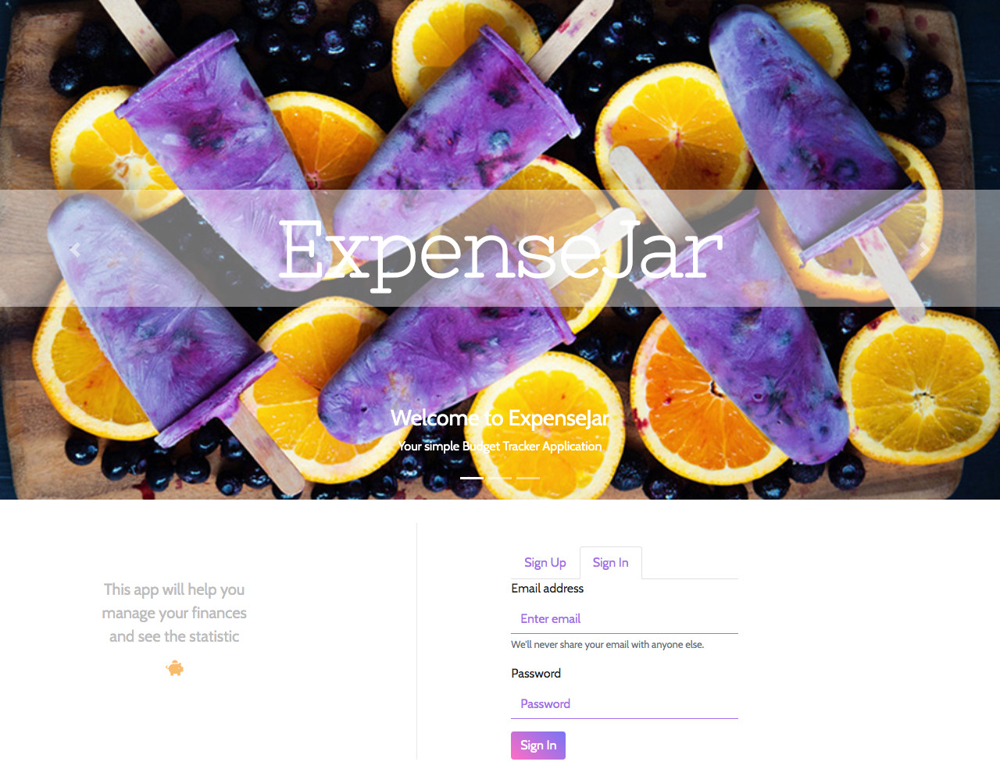
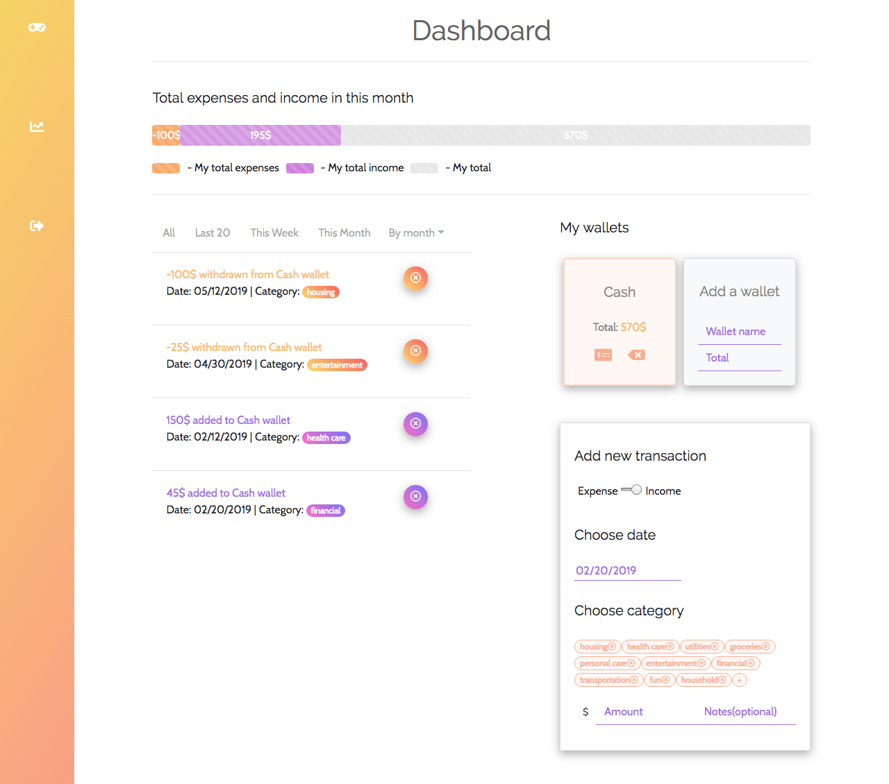
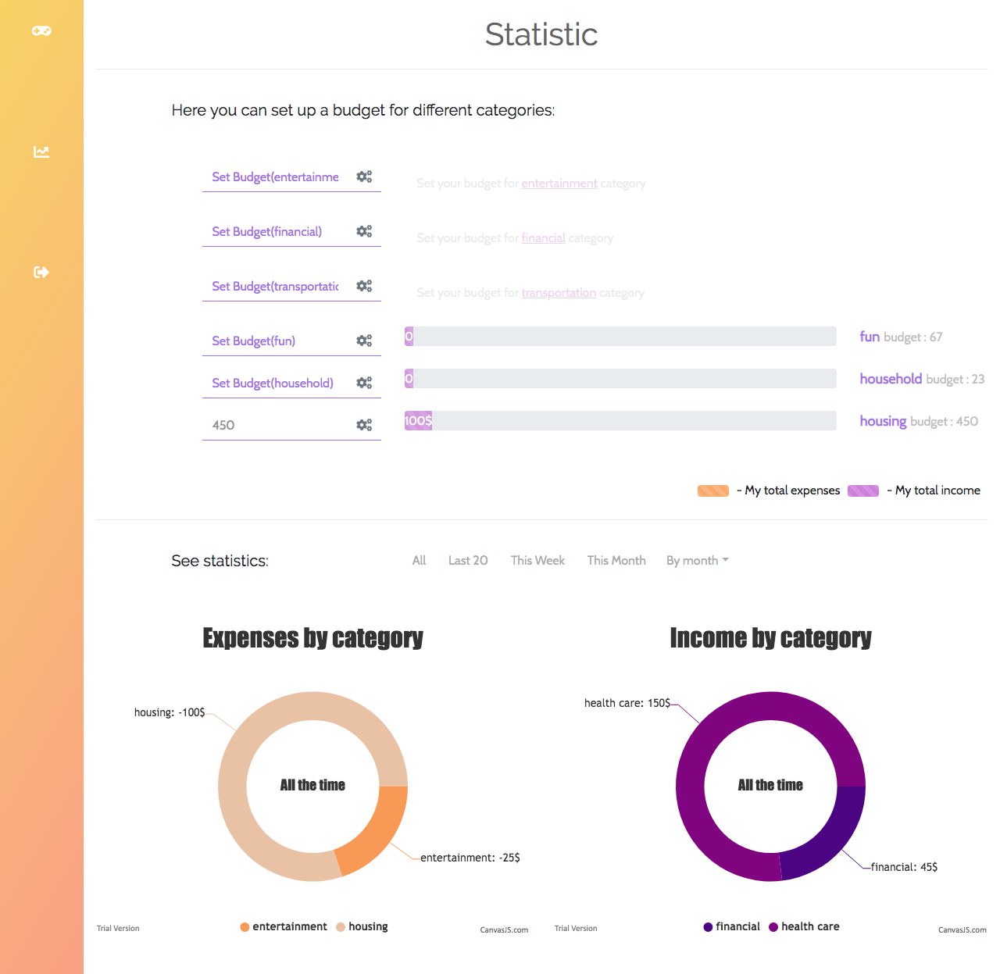
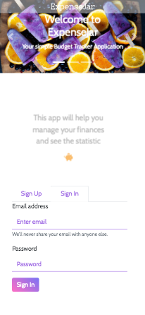
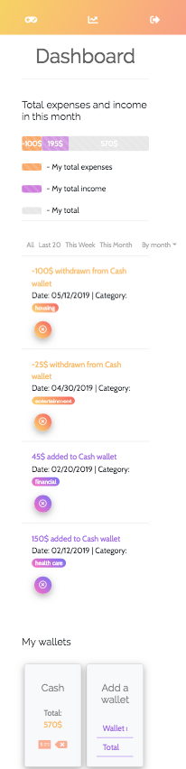
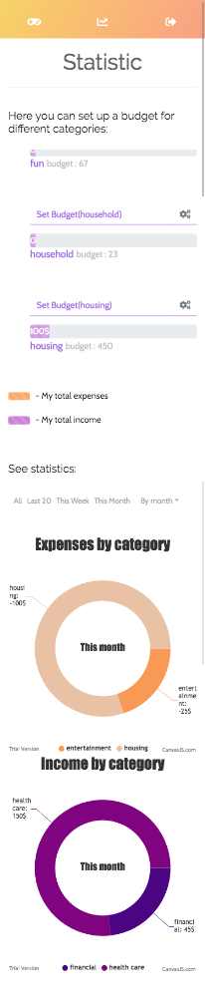

# EXPENSEJAR

### Overview

A React-based budget tracker application (mobile responsive). It helps to create a personal budget for you, tracks your expenses and income, visually show personal finance flowchart.
This Application uses React Redux to share one state between components.

### How to use application

There is a default user account you can use to check out the application.

- Credentials

  email: user@test.com
  password: 12345678

If you would like to create your own account, requirements for the password is at least 8 symbols long.

### Description

- This application has 3 pages:

  - [Landing Page] - User can read about the application, creat an account and sign in

  - [Dashboard] - Shows all the transaction that user has. User also has the abbility to create wallets, add new transactions and categories. It also displays total expenses and income in this month.

  - [Statistic] - Helps to set up budget for each category. Shows expenses and income statistics by each category.

### Tech:

- [React]
- [Redux]
- [Redux-thunk]
- [React-Bootstrap]

### Application screenshots

---

---

---

Mobile

---

---

